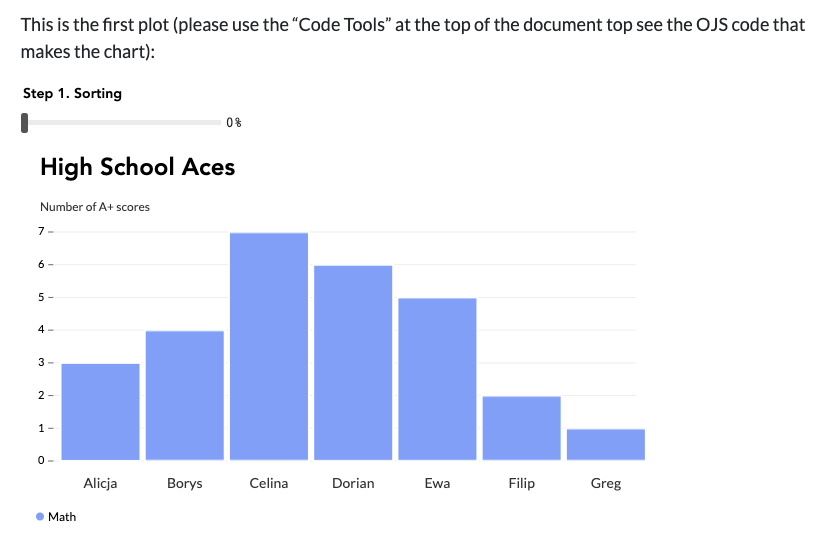

# Hello Plotteus

A Quarto R + OJS version of [this Observable notebook](https://github.com/bprusinowski/plotteus) to show how to wrangle data in R to pass to the library.

View at <https://rud.is/dl/hello-plotteus/index.html>.

